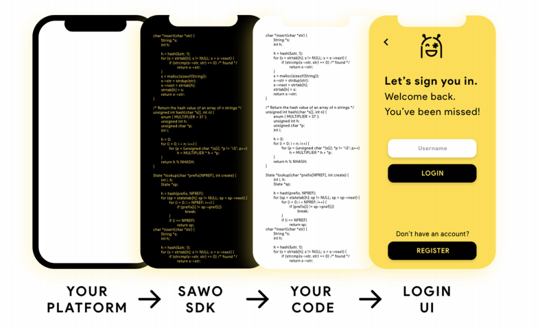

# Getting Started👋

### **What is SAWO?**

Secure Authentication Without OTP or SAWO is the next thing in authentication, we wish to provide convenience both to developers and the users using the same platform by providing a one-tap authentication service that is secure, swift and sustainable.

We are based on the pillars named **TRUST** as SAWO does not save any personal data of the user since it is end-to-end encrypted and is coupled with highly secure open standards working on Public Key Cryptography. **Security is** unlike any other standard as for us neither private data has to travel the internet nor any login credential has to be stored in a server thus removing software vulnerabilities possessed by standard processes. **Returns** are something which we drive for your product when you choose SAWO for your product, our product is ready to be integrated by your team within 6 minutes and thus making sure you invest crucial hours to develop your product, our one-step process which takes 0.06 seconds, only serves your users the experience they deserve and thus driving down your bounce rates and driving conversions.

If you wish to ask questions like Why a service over Single Sign-On or How much does it cost to secure your user in the best possible way or is your service provider a one-stop solution to your authentication need then keep reading!

### How does SAWO work

SAWO SDK acts as a hidden layer between your user and your platform, it's a magic layer which after a very fast integration is able to give you unmatched performance, you may wish to know about how this all flows from few lines of code to all solutions, thus let us take you through the journey.

Let's start with user registration, SAWO identifies the user on the initial registration process to help the client identify the data related to the user's identity and various other information.

From here on the user is issued two keys a public key and a private key, the user's device will retain the private key and register the public key to the service, so a fun fact is that SAWO is based on the [FIDO protocols](https://fidoalliance.org/how-fido-works/) which add another layer so that you do not provide information that can be used by different online services to collaborate and track a user across the services. Biometric information, if used, never leaves the user’s device.

Now let's figure out what happens when the user wishes to log in, so the server sends a challenge to the user's device, authentication is done by the client device by using the private key and proving possession, this signing of challenge can only happen through user device and thus making it secure and at the same time eliminating the need for passwords.

Also for user privacy, we even have OAuth protocols integrated through which we are able to make sure that for authenticated access to unrelated services and servers no sharing of the initial login credentials happens.

### **Why SAWO**  

SAWO is an authentication solution that can onboard users without any passwords or OTPs, thus making the process hassle-free, quick and secure. SAWO uses a strong cryptography-based authenticator which has a higher success rate than OTPs, passwords, and social logins. SAWO cares about privacy hence we provide all stakeholders with data autonomy. We also provide multi-platform SDKs, 12+ integrations, biometric authentication and save up to 75% of your authentication cost.

Let us tell you a bit more which may help you fall in love with SAWO

* **Biometric Authentication:** SAWO gives you the access to use your devices powers to the optimum, we have given the independence to use their choice of power be it using their fingerprint or IRIS or their voice even, as here the Biometrics are just the extra layer and as that extra layer is on the user's device the biometric data never leaves the user device thus optimizing authentication speeds too!
* **Data Autonomy:** We all are tired of social logins sharing our data without the normal user even being able to understand what data they are sharing or today's apps handing over the registration data to services, with SAWO we give you the power to control which data you want to share, with all being powered by SAWOs SDK and coupled with end to end encryption.
* **Decreases** **Bounce Rate:** As per the industry average, 55% of your traffic won't even tend to register on your website, biggest hassle faced here is lengthy and hassle full registration process, SAWOs swift and secure login process enables you to improve customer onboarding by 54%
* **Multi-platform Support:** Frameworks shouldn't be the challenge when you wish to give user's security and convenience thus we offer easy integration and support with all popular web, cloud, VPN, remote access gateway, and more
* **User Convenience:** Registration time decreased to seconds, the contact details which you were earlier just taking to add users to your mailing list which only have a 2% success rate, is now able to register your user using just them. To add to it a simple registration within seconds exponentially decreases bounce rates. Make your users forget about the hassles of passwords and enjoy your product and at the same time make it easier for them to check out products, using SAWOs inbuilt technology, your user would not have to waste any time on remembering passwords and a streamlined process will only enable conversions.

