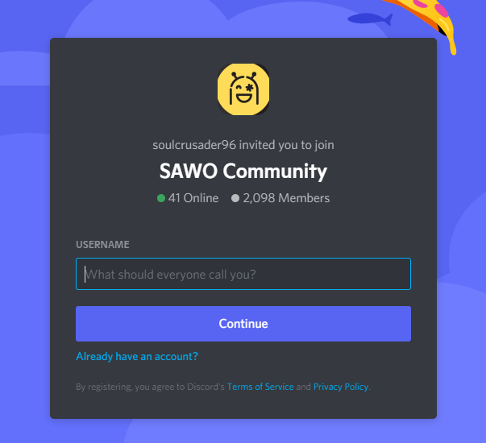
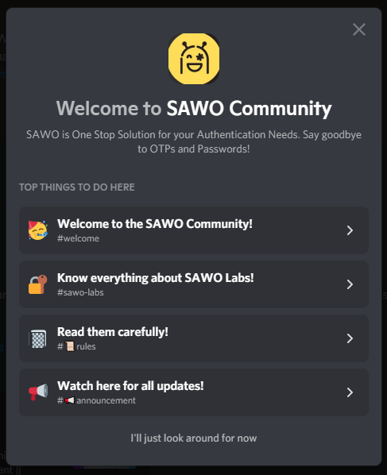
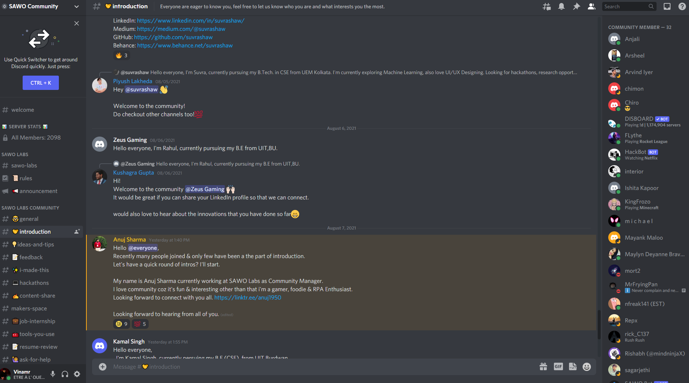
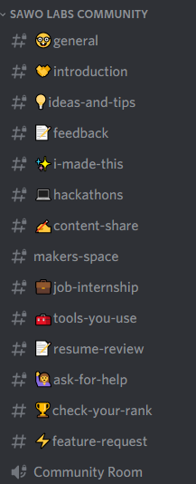

# Ask the community😮‍💨

#### **DISCORD**

**What is Discord?**

Discord is a free voice, video, and text chat app that's used by tens of millions of people ages 13+ to talk and hang out with their communities and friends.

People use Discord daily to talk about many things, ranging from art projects and family trips to homework and mental health support. It's a home for communities of any size, but it's most widely used by small and active groups of people who talk regularly.

Also, discord turns out to be the home of team SAWO and along with its a community of more than 2000 budding developers who are there to discuss and develop.

Going around on Discord and getting your work done

1. Firstly click on our community link: [https://discord.com/invite/TpnCfMUE5P](https://discord.com/invite/TpnCfMUE5P)
2. Now discord must have opened so the first task is to set up a username, you can ideally keep it as your name but there's always space for creativity and we do enjoy cool nicknames.

3. We already have a small welcome guide prepared for you at the server itself where you can choose what you are looking for

4. Ideally, we will recommend you to go to the introduction section and introduce yourself to the community, we have some awesome people who will love to interact with you

5.\) We already have made spaces for everything you will need, you can go into the following sections:

* feedback: Anything about SAWO which you wish to convey to us then this is the place
* i-made-this: We love to see what people are making you can showcase your products to the community
* ideas-and-tips: Have an idea which you wish to discuss with like-minded people or are looking to give or take some tips
* ask-for-help: Here we have a team of awesome developers to help you out with all queries which you can offer to them
* feature-request: We at SAWO always believe in innovating the product, so if you feel like there is something amiss and should be there, just point it out to us and we will have our team cook it up
* jobs-internship: SAWO is growing rapidly and thus we are always looking for awesome people to join the team, here find all the roles and all the information about them which you may need

