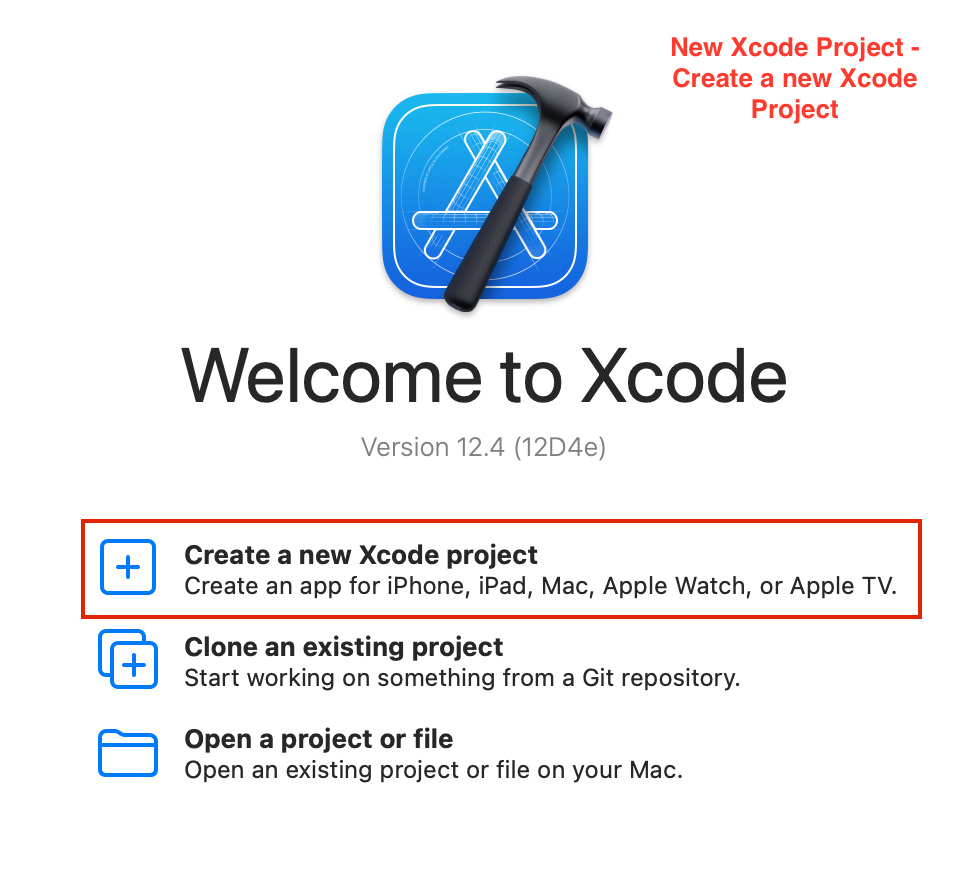
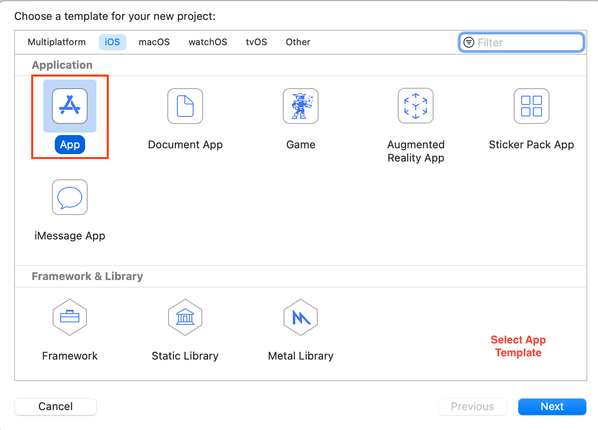
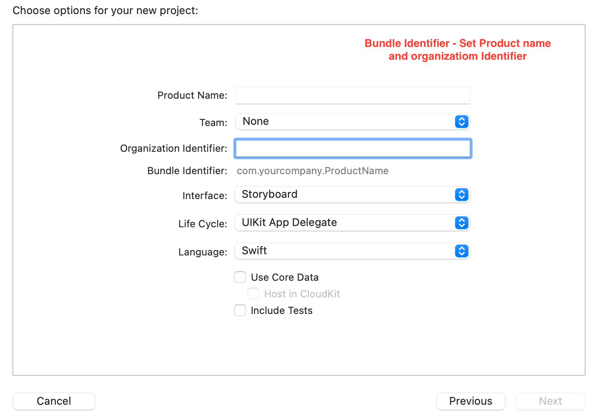
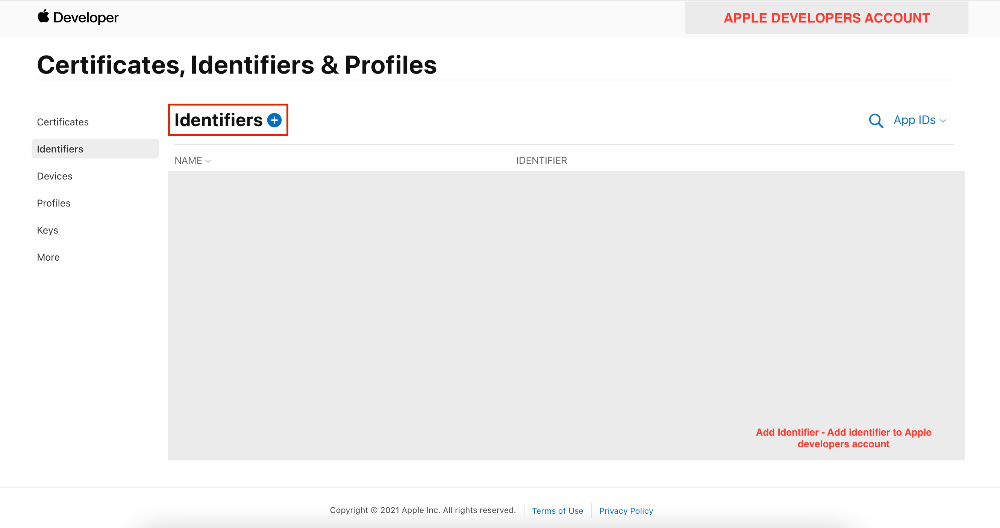
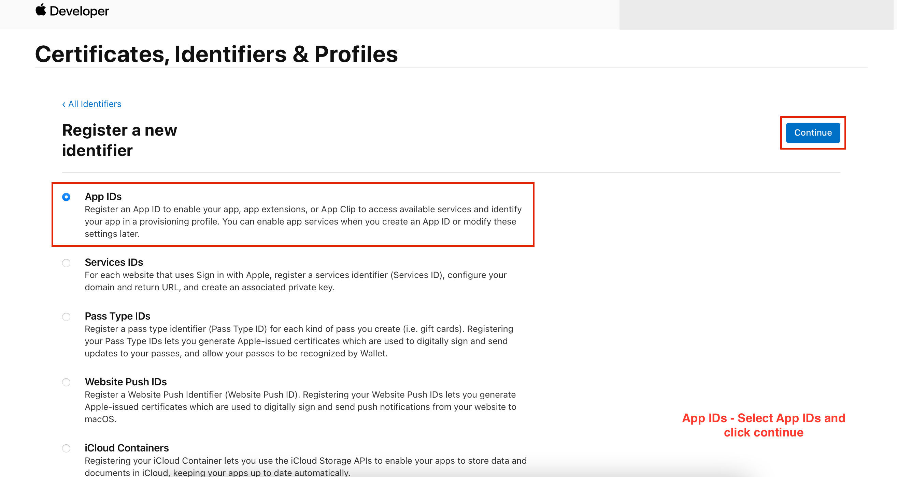
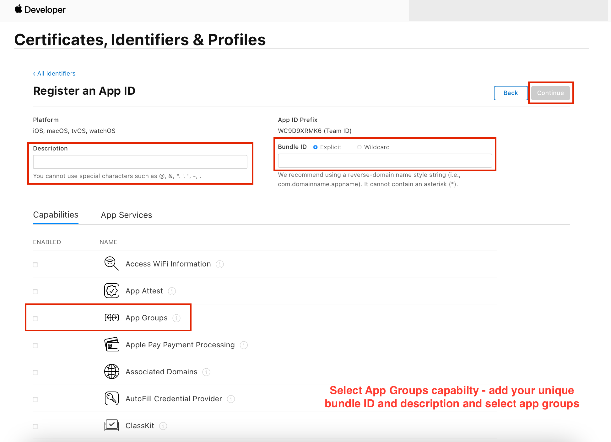
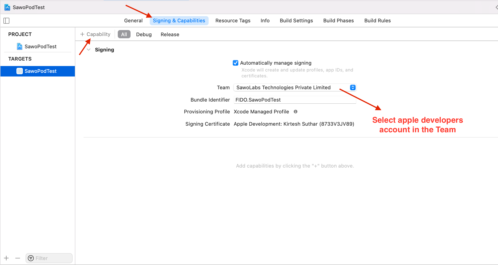
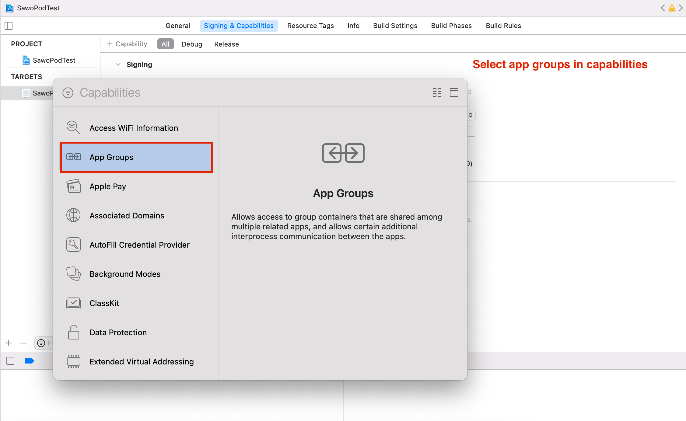
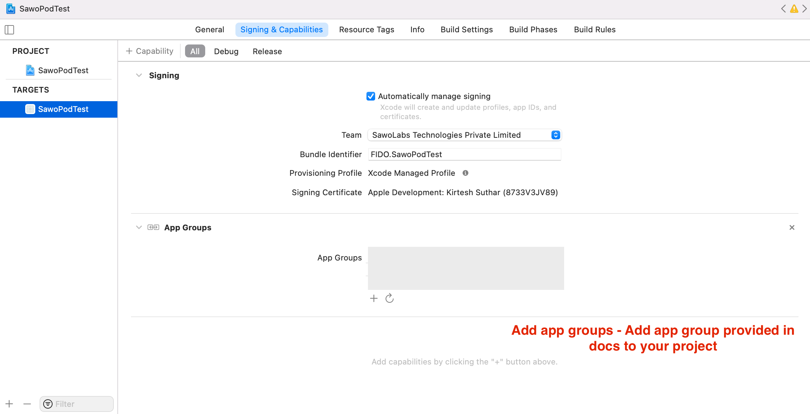

# iOS

### Let's Get your iOS App running with SAWO 🙌 

### **Steps**

#### iOS CocoaPod Integration

1 iOS CocoaPod Integration

2. Choose app in app templates.

3. Add unique Bundle Identifier.

4. Create an Apple Developer account ID and login.

5. Select Identifiers and click + icon.

6. Select App IDs in Certificates, Identifiers & Profiles Tab.

7. Select App as a type.

8. Add your bundle ID mentioned in the project created and 
description. Now select App groups in the capabilities.

9. Go to signing and capabilities and select teams with apple developer account linked to it and. Click on capabilities button

10. Select app groups in capabilities.

11. Add App group - “ ”

1. To use SAWO Login you would need an **API key** which can be obtained by creating a project in the [sawo dashboard](https://dev.sawolabs.com/). 

2. Copy the **API key** from the project and keep it safe and secure.


The best practice to store your API key is to store values in .env so that they are not exposed.


**Congratulations !! The SAWO API is now ready to be used in your iOS application** 🤘**.**  

#### You can also check out SAWO's [iOS Sample Code](https://github.com/sawolabs/ios-sdk-demo).

#### It's okay, we get it! You got Stuck! 😞 Feel free to contact us on \#ask-for-help on our [Discord](https://discord.com/invite/TpnCfMUE5P)

