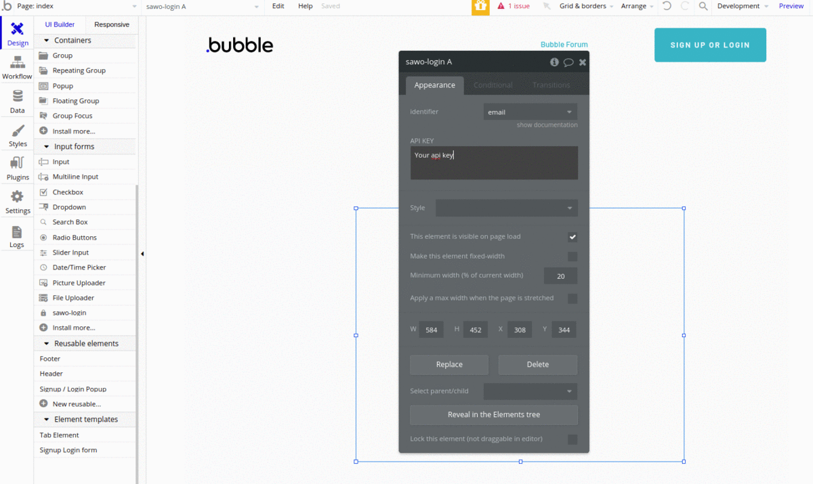

# Bubble

### **Steps** 

1.To start with SAWO API Integration on Bubble, **install the SAWO plugin** from the marketplace.

2.Next, the **SAWO login** has to be located under **input** forms and a **new login page** has to be **created**

3.Post this, we need to drag and drop the **sawo-login form**

4.**Double** click on the form and select the **identifier** as 'email' or 'phone'

5.To use SAWO Login you would need an **API key** which can be obtained by creating a project in the [sawo dashboard](https://dev.sawolabs.com/).

6.  Once you create your project, you would need to set your **project name and hostname.**  
    5.1. For **development** in a local machine, the hostname should be set to **'localhost'.**


If using ''localhost" as hostname is not working for you, try "127.0.0.1" 🤓 


       ****5.2. For the **production**, the hostname should be set to your **domain**. 


If you are adding your domain do not add 'https://', ''http://', 'www' or even trailing backslash.  
**Example:**  
`https://dev.sawolabs.com/` should be kept as `dev.sawolabs.com`


7. Copy the **API key** from the project and keep it safe and secure.

### **Workflow of the website**

1. To use email,create two actions-

* **'user\_signs\_up'**
* **'user\_logs\_in'**

For the respective action, **trigger** login or signup function.

**Note:**

* For **sawo** ’login form A’s identifier, mention it as an **email**
* For **sawo** ’login form A’s password, mention it as a **password**

2.To use phone number-

* **Append** the custom text by making a **Text ID.**
* Visit the **language** section and mention the **domain** '@xyz.in' against your **Text ID.**
* Use **Phone number** as **email identifier.** 

\*\*\*\*

### **Congratulations !! The SAWO API is now ready to be used in your Bubble application** 🤘**.**  

### It's okay, we get it! You got Stuck! 😞 Feel free to contact us on \#ask-for-help on our [Discord](https://discord.com/invite/TpnCfMUE5P)

