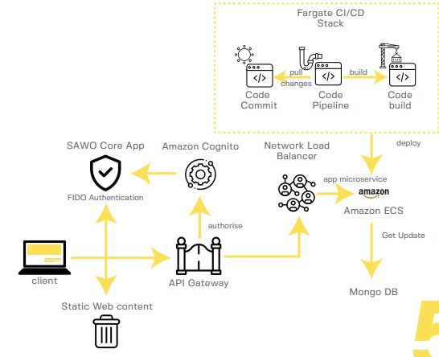

# Password

Proper planning is critical for the conduction of successful migration, at  SAWO we have already crafted the process to scale for you, the quickguide has outlined all requirements and design considerations, we have made sure that the process mitigates all risks and doesn't hold any disruptions for the end-user.  

## How can I implement SAWO in my Own App?

  
As you already have a authentication logic that validates passwords stored in your own   
Database. We don't store any data of our end clients. A simple payload is returned to you so it makes your life easier so you can map your clients with the identifier you chose

### Replacing your own Login form with Our Iframe

Let us handle your authentication so that you have to worry less

### What happens after you replace your login form?

after your client is successfully authenticated, a payload is sent from our side to your server so you can further process it from your end. Check out [_What to do with your payload?_](additonal-content/what-to-do-with-your-payload.md)\_\_

### New users signing up

if a new user gets authenticated, you can cross check with your Database and i

