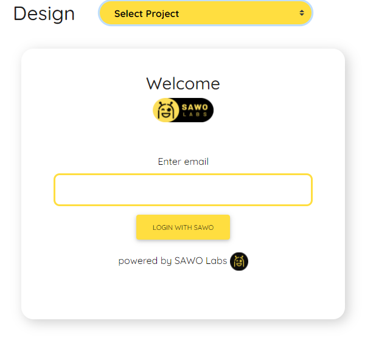

# Form Customisation and Design

SAWO was built in mind keeping and prioritizing both the user and the developer, you have already witnessed the functionalities and features of SAWO, now you have the SDK connected to your platform but another piece missing is the frontend, we all know how tiresome is to code the frontend and how even a small bug can stop work for hours. Thus we already ship our SDKs with a beautiful frontend but you must be like a single frontend can suit every user and thus we have enabled no-code customisation directly through the developer dashboard, let me take you through the experience of customising using the dashboard

### **Form Data Customisation**

1.\) So hope you have logged into the dashboard, in case this is your first time you will have Swarna there to help unless you can also go through the [dashboard guide](dashboard.md) to getting acquainted.

2.\) Head over to _**forms**_ first and using the dropdown select the project where you want to make changes

Where you will be able to see three types of fields

1. Choose Identifier Type: The default setting for the SAWO API is to enable user login through email but here you can decide between mobile or email.
2. Add Custom Fields: We understand that during registration firms may need more additional data objects, thus here you can add as many fields which you want to know from the user using just 2 clicks.
3. Identifier Verification: Here you can enable Google Recaptcha into your platform to add an extra layer of security.
4. Configuration: Here are the advanced settings, you can here set the Session cooldown, what should the SMS and Email bodies look like when a user attempts to get access.

### Form Design Customisation

1.\) Click on the design page in the navbar and select your project using the dropdown

2.\) From here changing your forms looks is just a matter of clicks and you can see the changes live with your form is shown on the right side.

Here feel free to choose the correct color scheme and make sure your forms looks exactly the way you want!

