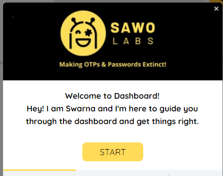
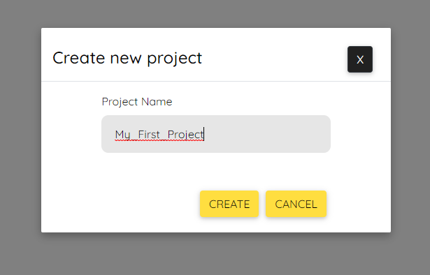
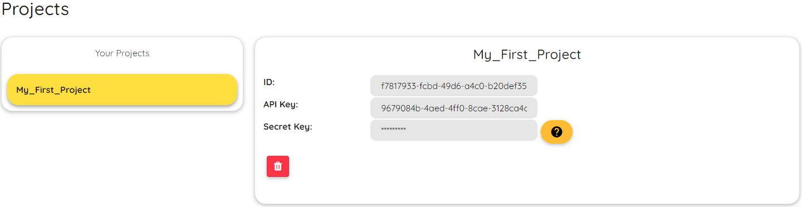

# Dashboard

**Dashboard**

SAWO's Developer Dashboard is just another step by us to make the developers happy too, the dashboard is the place where you can setup N number of your projects, get the keys for them and the most amazing thing is that you can easily optimize how the page will look directly from here without having to worry about the code, so feel free to play around with the awesome combinations of customizations we offer.

1.\) Just click onto the login button and you will be redirected to [dev.sawolabs.com](http://dev.sawolabs.com/) and from here only you can start to see the power of SAWO just enter your email id and you have your access.

2.\) We are always there to help and in case you are a first time user we already have Swarna there to guide you on your first project

3.\) You will automatically be directed onto the projects screen, here just click on create a new project and select the platform you are looking to build your product on

4.\) On selecting your platform you will find all the instructions right then and there which will get you to do the integration setup, do the required step and then just click onto continue and give your project a name.

5.\) On clicking create you will see your project has been created, the keys have already been downloaded onto your device and now let's head over the docs section and finish your integration

