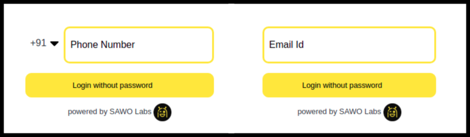

# Angular

## Let's Get your Angular App running with SAWO 🙌

## **Requirements**

Node \[Version 12.x+ \] , Node Package Manager \(NPM\) \[Version 6.x+\]

## **Steps**

1. The first step to getting started with SAWO API integration into your Angular web page is to **install the sawo** package as given below:

```text
npm i sawo
```

2. After installation is done, you have to **import the Sawo class** from the installed sawo package to the top of the file:

```javascript
import Sawo from "sawo"
```

3. To use SAWO Login you would need an API key which can be obtained by creating a project in the [sawo dashboard](https://dev.sawolabs.com/).

4. Once you create your project, you would need to set your **project name and hostname.**  
    4.1. For development in a local machine, the hostname should be set to 'localhost'.


If using ''localhost" as hostname is not working for you, try "127.0.0.1" 🤓


    4.2. For production, the hostname should be set to your domain. 


If you are adding your domain do not add 'https://', ''http://', 'www' or even trailing backslash.  
**Example:**  
`https://dev.sawolabs.com/` should be kept as `dev.sawolabs.com`


5. Copy the API key from the project and keep it safe and secure.


The best practice to store your API key is to store values in .env so that they are not exposed.


6. Initialise SAWO and render the form according to the following steps:

* As part of this step, a container has to be created for the SAWO component. This has to be done on your project’s source file.

```text
<div id="sawo-container" style="height: 300px; width: 300px;"></div>
```


Every added custom field should be accompanied by a `50px` increase in the component height.


* Some configurations have to be checked as given below. The code given below should help in the same.

```text
 var config = {
        // should be same as the id of the container created on 3rd step
        containerID: "<container-ID>",
        // can be one of 'email' or 'phone_number_sms'
        identifierType: "phone_number_sms",
        // Add the API key copied from 2nd step
        apiKey: "",
        // Add a callback here to handle the payload sent by sdk
        onSuccess: (payload) => {},
    };
```

* Then a SAWO instance has to be created using the code given below:

```text
let sawo = new Sawo(config)
```

* The **showForm** method should be called thereafter as the **showForm** method is responsible for rendering the form in the given container.

```text
sawo.showForm()
```

7. Below code-block can be used as a reference after you have completed setting up your project:

```text
import { Component } from '@angular/core';
import Sawo from "sawo"


@Component({
  selector: 'app-root',
  templateUrl: './app.component.html',
  styleUrls: ['./app.component.css']
})

export class AppComponent {
  
  title = 'angular-sawo-chander';
  Sawo: any;
  isLoggedIn:any= false;
  userPayload:any = {};

  constructor() {}

  ngOnInit(){
    const sawoConfig = {
      // should be same as the id of the container
      containerID: "sawo-container",
      // can be one of 'email' or 'phone_number_sms'
      identifierType: "phone_number_sms",
      // Add the API key
      apiKey: "",
      // Add a callback here to handle the payload sent by sdk
      onSuccess: (payload: any) => {
        this.userPayload = payload;
        this.isLoggedIn = true;
      }
    };
    // creating instance
    this.Sawo = new Sawo(sawoConfig)
  }

  ngAfterViewInit() {
    this.Sawo.showForm()
  }

}
```

8. Once the SAWO SDK is successfully set up, a **login form** will be rendered in the provided container as displayed in the picture below:



### **Congratulations !! The SAWO API is now ready to be used in your Angular application** 🤘**.**

### You can also check out SAWO's [Angular Sample Code](https://github.com/sawolabs/sawo-examples/tree/master/angular) and [Deployed App](https://github.com/sawolabs/sawo-examples/tree/master/angular).

### It's okay, we get it! You got Stuck! 😞 Feel free to contact us on \#ask-for-help on our [Discord](https://discord.com/invite/TpnCfMUE5P)

