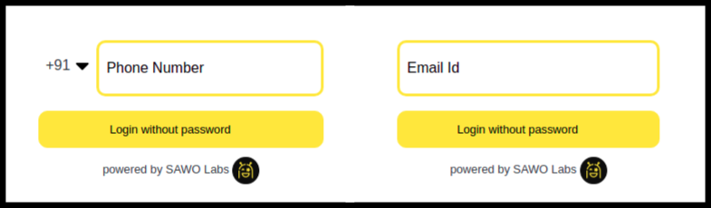

# HTML

### Let's Get your HTML running with SAWO 🙌

### **Requirements**


### **Steps**

1. To use SAWO Login you would need an **API key** which can be obtained by creating a project in the [sawo dashboard](https://dev.sawolabs.com/). 

2.  Once you create your project, you would need to set your project name and hostname.  
    2.1 For development in a local machine, the hostname should be set to 'localhost'.


If using ''localhost" as hostname is not working for you, try "127.0.0.1" 🤓 


    2.2 For production, the hostname should be set to your domain


If you are adding your domain do not add 'https://', ''http://', 'www' or even trailing backslash.  
**Example:**  
`https://dev.sawolabs.com/` should be kept as `dev.sawolabs.com`


3. Copy the API key from the project and keep it safe and secure.


The best practice to store your API key is to store values in .env so that they are not exposed.


4. On your source, create a container for sawo component inside `body` tag

```text
<div id="sawo-container" style="height: 300px; width: 300px;"></div>
```

5. Add the snippet at bottom of source inside `body` tag

```text
<script src="https://websdk.sawolabs.com/sawo.min.js"></script>    
<script>
    var config = {
        // should be same as the id of the container created on 3rd step
        containerID: "sawo-container",
        // can be one of 'email' or 'phone_number_sms'
        identifierType: "phone_number_sms",
        // Add the API key copied from 2nd step
        apiKey: "",
        // Add a callback here to handle the payload sent by sdk
        onSuccess: (payload) => {
            console.log(payload)
        },
    };
    var sawo = new Sawo(config);
    sawo.showForm();
</script>
```


**Recommended**: Verify the payload sent by SDK from your backend:

Python Example

```text
import requests

data = {
    'user_id': payload_sent_from_sdk['user_id']
}
res = requests.post('https://api.sawolabs.com/api/v1/userverify/', data=data)
# Match the verification token in response with sdk payload
if res.status_code == 200:
    response_data = res.json()
    if response_data['verification_token'] \
                == payload_sent_from_sdk['verification_token']:
            # continue with your implementation for example add the user to your db
```


Once the SAWO SDK is successfully set up, a login form will be rendered in the provided container as displayed in the picture below:



### **Congratulations !! SAWO Login is now ready to be used in your HTML page**🤘**.**

### You can also check out SAWO's [HTML Sample Code](https://github.com/sawolabs/html-example).

### It's okay, we get it! You got Stuck! 😞 Feel free to contact us on \#ask-for-help on our [Discord](https://discord.com/invite/TpnCfMUE5P)

