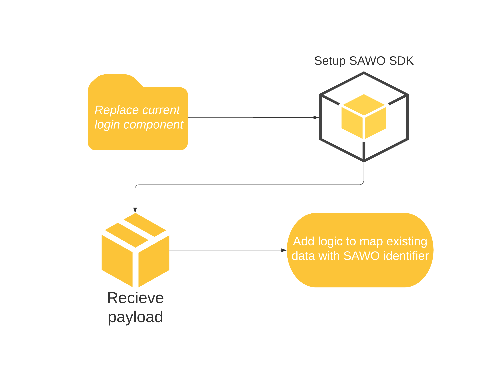

# Social Sign On to SAWO

Proper planning is critical for the conduction of successful migration, at  SAWO we have already crafted the process to scale for you, the quickguide has outlined all requirements and design considerations, we have made sure that the process mitigates all risks and doesn't hold any disruptions for the end-user.



## How can I implement SAWO in my Own App/Website?

As you already have an authentication logic that validates passwords stored in your own database, most of the work has been completed by you and we don't want you to worry about anything else now, so,  we don't store any data of our end clients.   
A simple payload is returned to you using which you can conveniently map your clients with the identifier you chose.


### How does our SDK work? 

We authenticate your end customer with asymmetric encryption and post out a payload of your client with details.


### Replacing your Login form with Our iframe

This is the moment from where we start taking over your worries, initially, we request you to replace your current login form with SAWO.

### What happens after you replace your login form?

After your client is successfully authenticated, a payload is sent from our side to your server so you can further process it from your end. Check out [_What to do with your payload?_](additonal-content/what-to-do-with-your-payload.md)\_\_

### New users signing up

If a new user gets authenticated, you can cross check with your Database and i

